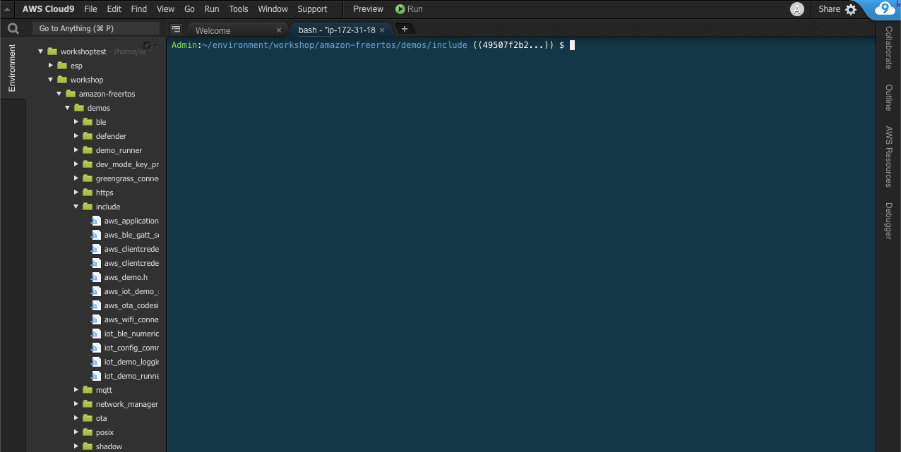
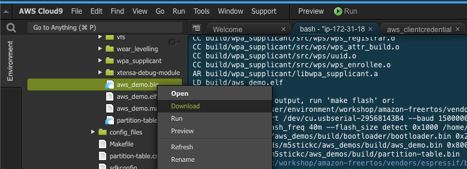

# Steps to compile the workshop firmware for M5STICKC (ESP32)

## Clone the repo

In your Cloud9 terminal environment, clone the lab repo:

```bash
cd ~/environment
git clone https://github.com/teuteuguy/amazon-freertos-m5stickc-workshop.git --recurse-submodules workshop
```

## Setup your credentials

### Create the aws\_clientcredential\_keys.h

Navigate to [https://yona75.github.io/credformatter/](https://yona75.github.io/credformatter/), upload your Certificate and Private key that you downloaded in the [previous](./iotcoresetup.md) step and generate an aws\_clientcredential\_keys.h file.

### Copy aws\_clientcredential\_keys.h to project

Copy the file to ~/environment/workshop/amazon-freertos/demos/include/ directory by dragging it there



### Edit aws_clientcredential.h

Open the aws\_clientcredential.h file by double-clicking on it. And change the following values:

```bash
...
#define clientcredentialMQTT_BROKER_ENDPOINT "[YOUR AWS IOT ENDPOINT]"
...
#define clientcredentialIOT_THING_NAME "[THE THINGNAME YOU CREATED]"
...
#define clientcredentialWIFI_SSID       "[WILL BE PROVIDED]"
...
#define clientcredentialWIFI_PASSWORD   "[WILL BE PROVIDED]"
...
#define clientcredentialWIFI_SECURITY   eWiFiSecurityWPA2
...
```

> Note: clientcredentialWIFI\_SECURITY is defined without double quotes


## Setup the code

```bash
cp -R ~/environment/workshop/m5stickc ~/environment/workshop/amazon-freertos/vendors/espressif/boards
```

## Configure the code

Run make menuconfig and simply exit. This will setup the defaults.

```bash
cd ~/environment/workshop/amazon-freertos/vendors/espressif/boards/m5stickc/aws_demos

make menuconfig
```

Click *Save* and then *Exit*


## Compile the code

```bash
make all -j4
```

If compilation is successful, you should be greeted with the following message:

```bash
esptool.py v2.6
To flash all build output, run 'make flash' or:
python /home/ec2-user/environment/workshop/amazon-freertos/vendors/espressif/esp-idf/components/esptool_py/esptool/esptool.py --chip esp32 --port /dev/cu.usbserial-29568143B4 --baud 1500000 --before default_reset --after hard_reset write_flash -z --flash_mode dio --flash_freq 40m --flash_size detect 0x1000 /home/ec2-user/environment/workshop/amazon-freertos/vendors/espressif/boards/m5stickc/aws_demos/build/bootloader/bootloader.bin 0x20000 /home/ec2-user/environment/workshop/amazon-freertos/vendors/espressif/boards/m5stickc/aws_demos/build/aws_demo.bin 0x8000 /home/ec2-user/environment/workshop/amazon-freertos/vendors/espressif/boards/m5stickc/aws_demos/build/partition-table.bin
```

## Download the binary files

Once compilation is done, download these 3 files to your local computer:

* *build/aws_demos.bin*
* *build/partitions_example.bin*
* *build/bootloader/bootloader.bin*



> Note: the "build" folder is located in ~/environment/workshop/amazon-freertos/vendors/espressif/boards/m5stickc/aws_demos/build


## Next Step

[Flash and monitor the code](./flashing.md)

