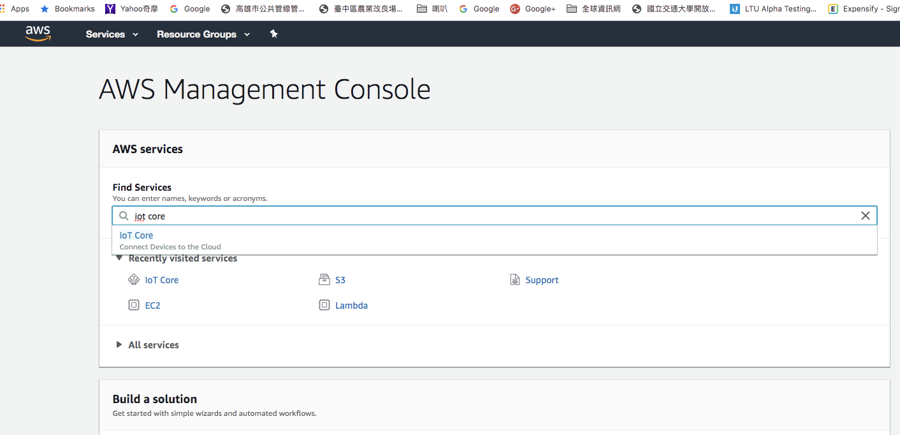
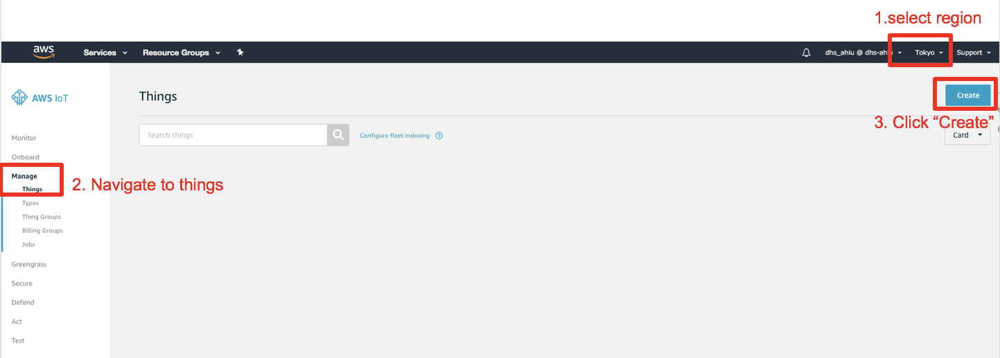
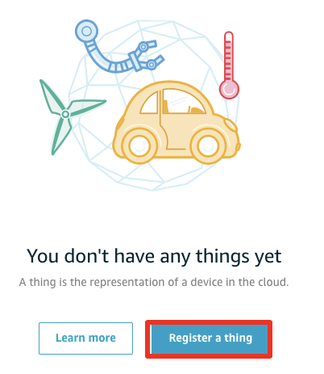
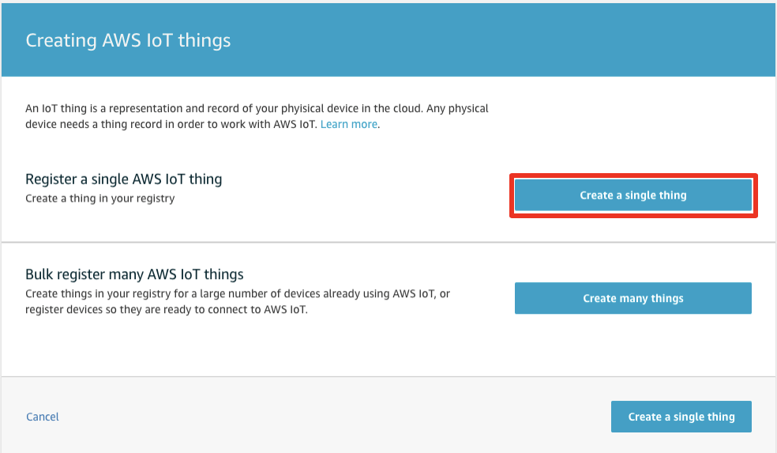
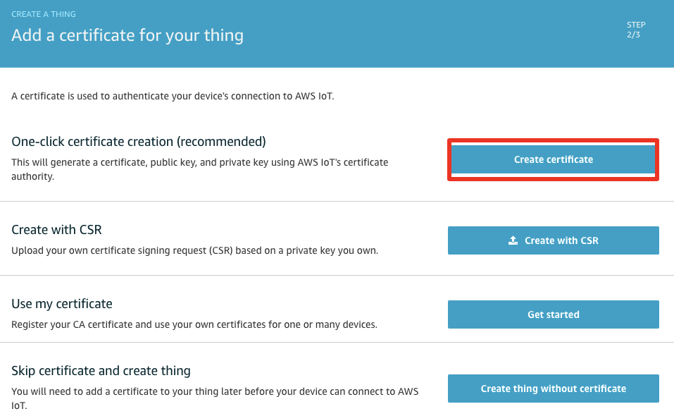
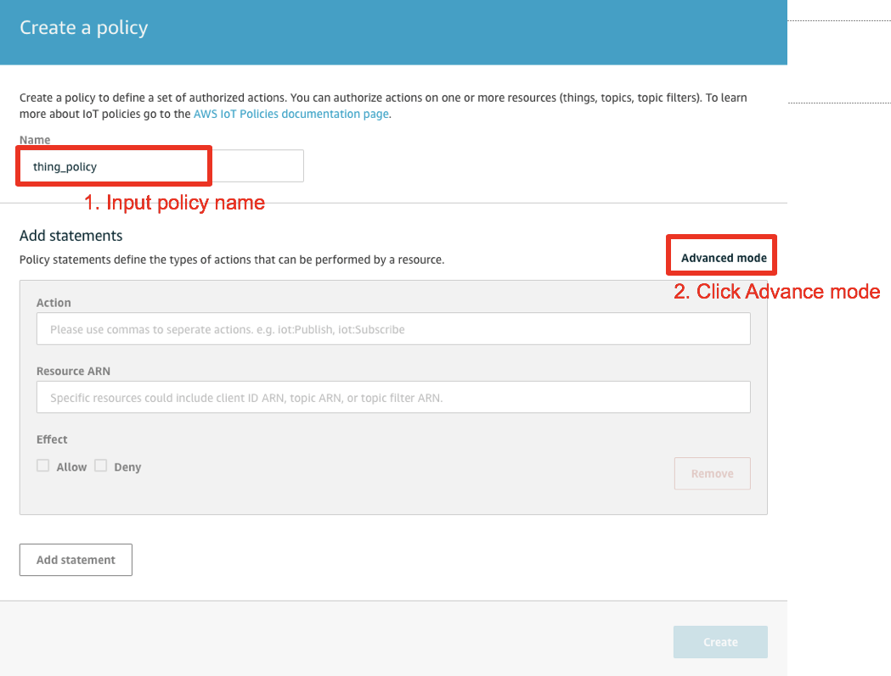
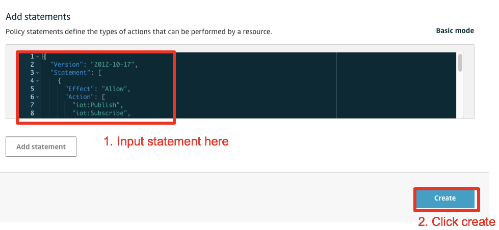
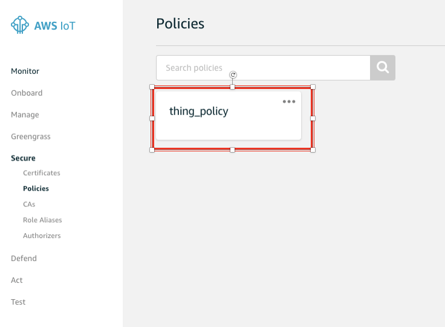
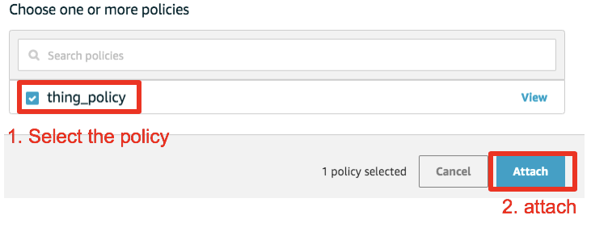
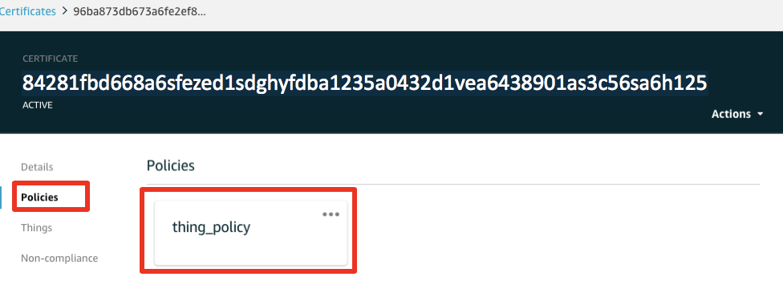

# Create your AWS IoT Thing

## Creating a thing requires 3 main steps:

1. Create a thing for the device in IoT Core
2. Create a certificate and attach it to the thing
3. Create a Policy and attach it to the certificate

## Create a thing for your IoT device in AWS IoT Core

Navigate to IoT Core to enter AWS IoT services


Follow the below 3 steps to register your thing:

1. Before you create a thing, please select the region. please select **us-east-1**
2. To Create a thing, navigate to Manager → Things
3. Click Create to start creation and registration of your device



If this is the very first time you create a device, the following page will appear, please click “**Register a thing**” to get started



In Creating AWS IoT Things page, choose **“create single thing“**



Input a device name of your choice and click **“Next”**


## Create a certificate and attach it to the thing

Choose One-click certificate creation



If this is the first time you create a thing in AWS IoT, you may not have a policy for the thing. you can click “Register Thing” and attach policy later.


So let’s see exactly what was generated.

* a thing named “[YOUR CHOSEN DEVICE NAME]”


* A certificate that is attached to the thing


* certificates that you’ve downloaded in your local PC


> Note - Do not lose this zip file, it contains your private key file which cannot be retrieved again.

## Create a Policy and attach it to the certificate

Next step we will create a policy to the certificate we’ve created in the previous step

input the policy name and enter advanced mode to past the policies

copy the following policy statement into the statements


```bash
{
  "Version": "2012-10-17",
  "Statement": [
    {
      "Effect": "Allow",
      "Action": [
        "iot:Publish",
        "iot:Subscribe",
        "iot:Connect",
        "iot:Receive"
      ],
      "Resource": [
        "*"
      ]
    },
    {
      "Effect": "Allow",
      "Action": [
        "greengrass:*"
      ],
      "Resource": [
        "*"
      ]
    }
  ]
}
```

copy the above policy statement and create


After creation, in the IoT Core console, navigate to **“Secure → Policies**“ your policy should be there 


navigate to **“Secure → Certificates**“ 


In the certificate page click **“Actions → Attach policy”**, 


Select policy and attach


Now, check the polices of the certificate, and the policy you’ve added should be there



## Next Step

[Compile the Amazon FreeRTOS workshop code](./compileworkshopcode.html)

